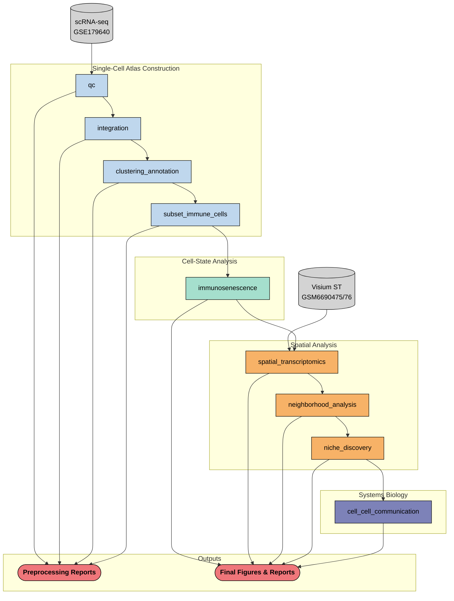

# endometriosis-spatial-immune-atlas

A reproducible Snakemake pipeline for spatial immune and immunosenescence profiling in endometriosis using public single-cell and spatial transcriptomics data.

---

## Background

Endometriosis affects approximately 1 in 10 women of reproductive age and is characterized by the growth of endometrial-like tissue outside the uterus. Despite its prevalence, the immune landscape of endometriotic lesions remains poorly characterized at single-cell resolution. This project integrates scRNA-seq and spatial transcriptomics to map immune cell states, with a focused analysis on immunosenescence  the acquisition of a senescent phenotype by immune cells  within ectopic, eutopic, and healthy endometrial tissue.

---

## Biological Questions

1. How do immune cell states differ across ectopic, eutopic, and healthy endometrium?
2. Are immunosenescent populations enriched in endometriotic lesions?
3. How do senescence-high immune cells spatially organize within the lesion microenvironment?
4. What ligand-receptor interactions are enriched between senescent immune cells and other cell types in the lesion niche?

---

## Datasets

| Accession | Type | Description |
|---|---|---|
| GSE179640 | scRNA-seq | Ectopic, eutopic, and healthy endometrium (Tan et al.) |
| GSM6690475 / GSM6690476 | Visium ST | Ectopic endometriosis lesion tissue sections |

---

## Pipeline Overview
This project is built as a modular Snakemake pipeline. Each analysis step is an independent rule with defined inputs, outputs, and parameters controlled via `config/config.yaml`.

```
endometriosis-spatial-immune-atlas/
|-- README.md
|-- RESULTS.md
|-- config
|   `-- config.yaml
|-- envs
|   |-- ccc.yaml
|   |-- cell2location.yaml
|   |-- cellcharter.yaml
|   |-- single_cell.yaml
|   `-- spatial.yaml
|-- figures
|   |-- GSE179640
|   |   |-- annotation
|   |   |-- cell_communication
|   |   |-- clustering
|   |   |-- immunosenescence
|   |   |-- integration
|   |   `-- qc
|   |-- exploratory
|   |   |-- integration
|   |   `-- qc
|   `-- spatial
|       |-- cell2location
|       |-- data_collection
|       |-- immune_architecture
|       |-- immunosenescence
|       |-- niche_ccc
|       `-- niche_discovery
|-- logs
|-- models
|-- notebooks
|   |-- 00_spatial_data_collection.ipynb
|   |-- 01_sc_data_collection.ipynb
|   |-- 02_sc_quality_control.ipynb
|   |-- 03_sc_integration.ipynb
|   |-- 04_sc_clustering.ipynb
|   |-- 05_sc_immune_annotation.ipynb
|   |-- 06_sc_immunosenescence.ipynb
|   |-- 07_spatial_cell2location.ipynb
|   |-- 08_spatial_immune_architecture.ipynb
|   |-- 09_spatial_immunosenescence.ipynb
|   |-- 10_spatial_niche_discovery.ipynb
|   |-- 11_sc_ccc.ipynb
|   `-- 12_spatial_niche_ccc.ipynb
|-- results
|   |-- GSE179640
|   |   |-- annotation
|   |   |-- cell_communication
|   |   |-- clustering
|   |   |-- immunosenescence
|   |   `-- qc
|   `-- spatial
|       |-- immune_architecture
|       |-- immunosenescence
|       |-- niche_ccc
|       `-- niche_discovery
|-- scripts
|   |-- 01_data_collection.py
|   |-- 02_qc.py
|   |-- 03_integration.py
|   |-- 04_total_clustering.py
|   |-- 05_immune_annotation.py
|   `-- metadata_gse179640.py
`-- workflow
    |-- Snakefile
    `-- rules
        |-- 00_spatial_collection.smk
        |-- 01_data_collection.smk
        |-- 02_qc.smk
        |-- 03_integration.smk
        |-- 04_total_clustering.smk
        |-- 05_immune_annotation.smk
        |-- 06_immunosenescence.smk
        |-- 07_cell2location.smk
        |-- 08_spatial_architecture.smk
        |-- 09_spatial_immunosenescence.smk
        |-- 10_niche_discovery.smk
        |-- 11_single_cell_ccc.smk
        `-- 12_spatial_niche_ccc.smk
```

### DAG



---

## Notebook Outline

| Notebook | Tools | Description |
|---|---|---|
| 00_spatial_data_collection | AnnData | Data loading, AnnData generation, sample labeling |
| 01_sc_data_collection | AnnData | Data loading, AnnData generation, sample labeling |
| 02_sc_quality_control | Scanpy | Quality control, cell filtering, doublet removal |
| 03_sc_integration | Scanpy, harmonypy | Dataset integration, batch correction, PCA |
| 04_sc_clustering | Scanpy | Broad cell type annotation |
| 05_sc_immmune_annotation | Scanpy, CellTypist | Immune subsetting, fine-resolution clustering/annotation |
| 06_sc_immunosenescence | Scanpy | Senescence and dysfunction scoring, cell state classification, DEG analysis|
| 07_spatial_cell2location | cell2location | Spatial deconvolution, spatial immune mapping within lesions |
| 08_spatial_immune_architecture | Squidpy | Identification of spatially enriched immune neighborhoods |
| 09_spatial_immunosenescence | Squidpy | Identification of spatially enriched cellular neighborhoods and cell-state co-localization patterns |
| 10_spatial_niche_discovery | CellCharter | Discovery/characterization of multicellular tissue niches |
| 11_sc_ccc | LIANA+ | Ligand-receptor inference between neighboring cell populations and tissue niches |
| 12_spatial_niche_ccc | Squidpy | Ligand-receptor inference between tissue niches |

---

### Setup

```bash
# clone the repo
git clone https://github.com/taimcnugget/endo-immune-atlas.git
cd endo-immune-atlas

# create the conda environment
conda env create -f envs/endo_env.yaml
conda activate endo_pipeline

# download data from GEO
# GSE179640: https://www.ncbi.nlm.nih.gov/geo/query/acc.cgi?acc=GSE179640
# GSM6690475: https://www.ncbi.nlm.nih.gov/geo/query/acc.cgi?acc=GSM6690475
# GSM6690476: https://www.ncbi.nlm.nih.gov/geo/query/acc.cgi?acc=GSM6690476
# place downloaded files in data/raw/ following the structure in config/config.yaml

# dry run to verify the Snakemake workflow
snakemake -s workflow/Snakefile -n

# run the automated core workflow
snakemake -s workflow/Snakefile --cores 4
```

The repository also includes draft Snakemake rules and configuration entries for downstream analyses planned for v2. These are retained as workflow scaffolding but are not included in the current executable v1 pipeline.

---

## Status
v1 of the project is complete! The core single-cell workflow, from data download through immune cell subsetting, can be run via Snakemake. The numbered notebooks contain the full downstream analysis and can be explored for additional details. 

---

## Future Directions
For v2 of this project I would like to:

- Investigate network characterization of senescent and dysfunctional tissue ecosystems.
- Extend the Snakemake workflow to cover the downstream analyses currently contained in notebooks.
---

## Author

Tailynn Y. McCarty, PhD
Biomedical Engineering | Computational Immunology | Systems Biology  
[LinkedIn](https://linkedin.com/in/tailynn)
