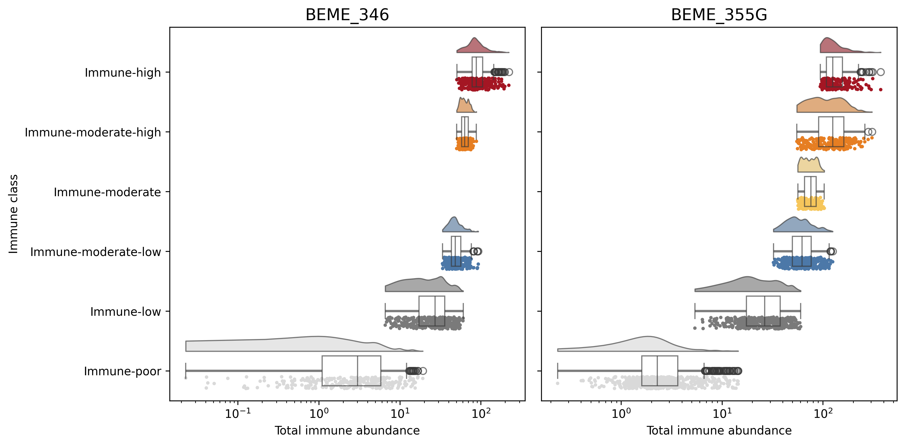
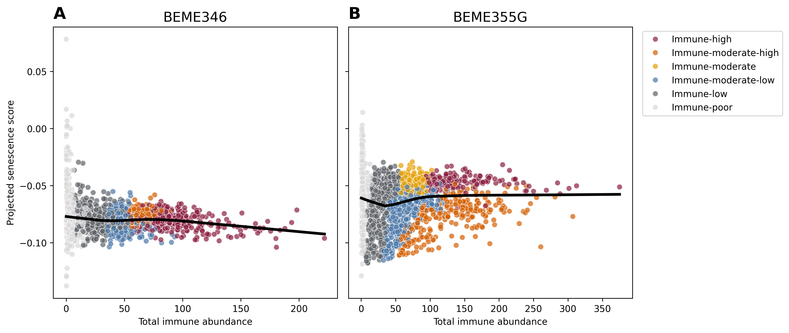
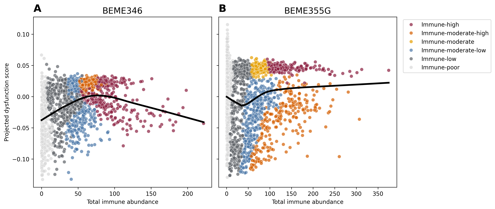
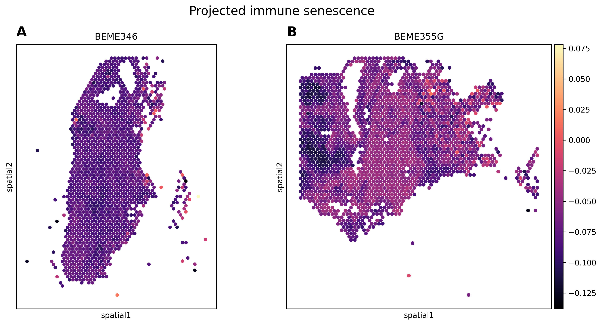
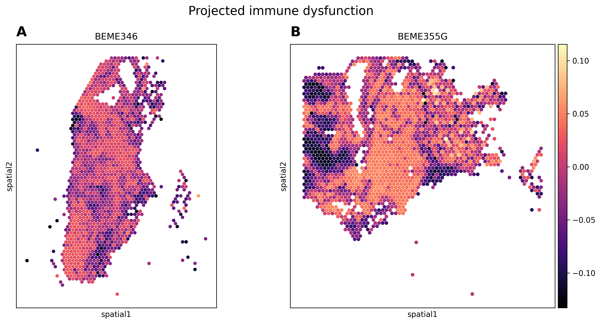
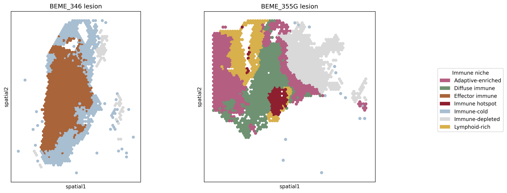
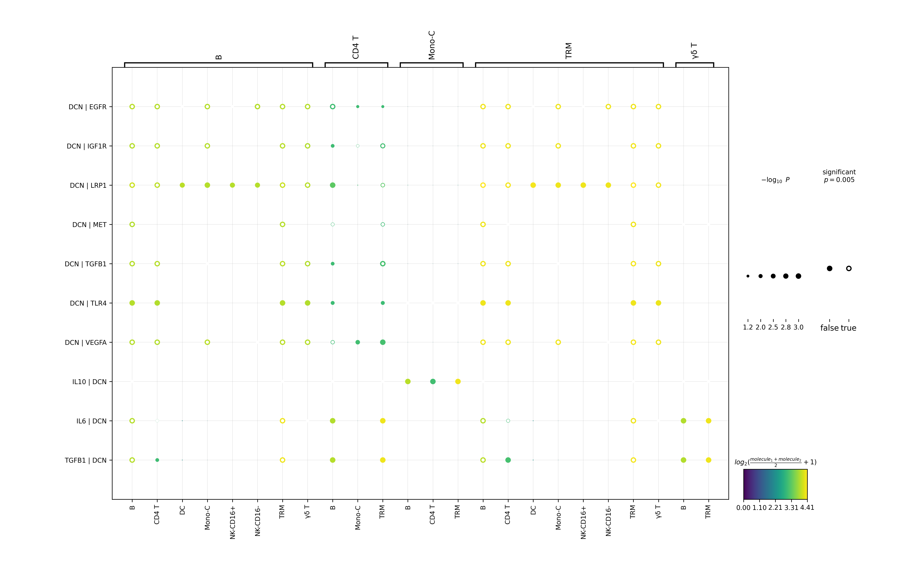
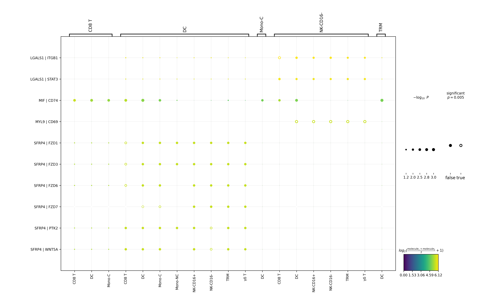
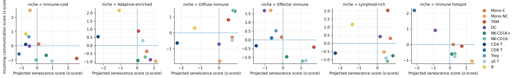
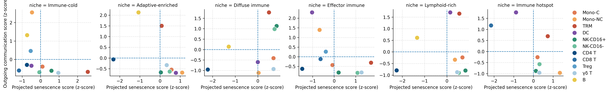

# PROJECT RESULTS

## 1. Study Overview

This study aims to focus on the immune landscape in endometrial cells and tissues. With the rise of sequencing technologies, the immune landscape of endometriotic lesions have become widely explored [1]. Recently, there has been a rise of research investigating the role of cellular senescence in endometrial microenvironments, potentially leading to disease states [2-4]  This project integrates scRNA-seq and spatial transcriptomics to map immune cell states, with a focused analysis on immunosenescence the acquisition of a senescent phenotype by immune cells within ectopic, eutopic, and healthy endometrial tissue.

## 2. Analysis Workflow

``` plain text
Raw scRNA-seq
      │
			QC
      │
Integration
      │
Immune subset
      |
Cell annotation
      |
Senescence projection
      |
sc-cell-cell communication (sc-CCC)
      |
──────────────────────────────
      │
Spatial transcriptomics
      │
cell2location
      │
CellCharter niches
      │
Spatial CCC
```

## 3. Dataset

| Dataset | Technology | Samples | Purpose |
|---|---|---|---|
| GSE179640 | scRNA-seq | Ctrl, eutopic endometrium (EuE), ovarian ectopic endometrium (EcO), peritoneal ectopic endometrium (EcP) | Immune atlas |
| BEME346 | Visium | Peritoneal ectopic endometrium | Spatial mapping |
| BEME355G | Visium | Peritoneal ectopic endometrium | Spatial mapping |

## 4. Quality Control
Quality control parameters were taken directly from original authors. [5]

The following QC metrics were applied:

1. Cells with >15% mitochondrial genes were removed since these cells represent damaged/dying cells and are unwanted in analysis.
2. Cells with less than 500 and more than 2000 genes were excluded. These cells represent outliers in genetic content and are also unwanted in analysis.
3. Because each single cell sample came from different patients, there were batch effects within the data when combined. To address this, Harmony was applied for batch correction so each patient could be compared. [6]

Before analysis, the single cell information from each patient were combined into a single object. Quality control measurements were then taken to ensure that there doublets were removed and outlier cells were removed, as to not interfere with outcomes.

**Key takeaway**:
> Batch effects were substantially reduced following Harmony integration while preserving biological structure.

## 5. Immune Cell Atlas
Initially, cells were clustered to observe broad cell compartments, resulting in 5 cell groups: endothelial, stromal, epithelial, myeloid, lymphoid. 

<p align="center">
  
</p>
<p align="center">
  
</p>

To investigate the immune cell populations within samples, the myeloid and lymphoid clusters were subset for further analysis. To ensure optimal clustering parameters, various k values for Leiden clustering were explored. A value was chosen that resolved  major immune cell types without over clustering. Within the broad cell compartments, 13 immune cell types were observed within the tissues. Here CellTypist was used to annotate clusters, followed by manual validation [7-8]. Each of these immune cell types play an important role in endometrial disease progression, which has been reviewed [9, 10-11].

<p align="center">
  
</p>

<p align="center">
  
</p>

I observed tissue level immune cell differences with CD16- NKs being the most abundant in Ctrl and EuE samples, TRMs being the most abundant in EcO, and Classical monocytes being the most abundant in EcP samples. It should be noted that cell-type proportions describe the composition of recovered immune cell population rather than the absolute composition of the tissue. To address this limitation, I integrated spatial transcriptomics and cell2location [12], allowing high-resolution immune state characterization from single-cell data to be interpreted within its native state. Overall, the major immune populations include: 𝞬ẟ T cells, TRMs, NK cells.

**Key takeaway**:
> Tissue-level immune cell composition differences were observed between tissues. 

## 6. Cellular Senescence Landscape

Immunosenescence has been defined as a gradual breakdown of the immune system via immune organ dysfunction [13]. The overall goal of this analysis was to identify cells with **relatively elevated senescence and dysfunctional -associated transcriptional programs** of endometrial cells.

The core senescent markers included CDKN1A, CDKN2A, and RB1, SAPS markers included IL-6, CXCL8, MMP9, and TNF [14-15]. Because the function of some immune cells is to secrete pro-inflammatory cytokines included in the SASP marker list, an additional marker was included based on immune cell compartment. Innate specific senescent markers included MARCO, SPP1, and APOE, while adaptive specific senescent markers included B3GAT1, KLRG1, and PDCD1 [16-19]. For dysfunction, a more thorough method was applied, and each overall cell type received their own dysfunction score. These independent scores were then used to create a composite senescence score that was used in downstream analysis.

I would like to stress that there is no formally recognized set of senescent markers because each cell type has distinct mechanisms that go awry due to aging and senescence, therefore making it incredibly difficult to characterize [20-21]. Furthermore, since the immune system is sensitive to perturbations, there may be human to human variation in these marker abundances within patients. I used my previous knowledge developing during my PhD on aging and the Human Senescence Atlas to derive these markers [14].

Gene set scores were calculated independently for each immune cell type to account for baseline transcriptional differences between immune populations. For each cell type, senescence- and dysfunction-associated gene signatures were scored using Scanpy’s `score_genes` function. And then scores were standardized within each immune cell type using z-score normalization. This method identifies cells with relatively elevated senescence or dysfunction compared with phenotypically similar cells. Cells within the top 25 percentile were classified as SEN-high, DYS-high or SEN-high & DYS-high, while all remaining cells were classified as Other.

<p align="center">
  
</p>

Since senescence and dysfunction are often correlated, the senescence and dysfunction scores were compared and the correlation between the two was calculated using Spearman’s correlation. Interestingly, all T cell groups (𝞬ẟ, CD4, CD8, and Tregs) had increased rho scores, suggesting particularly strong coupling between senescence- and dysfunction-associated transcriptional programs in T-cell populations.

<p align="center">
  
</p>

## Differential Gene Expression (DEG)

Lastly, the differential gene expressed between SEN/DYS-high and SEN/DYS-low cell gene expressed was explored. While all cells showed some DEGs, TRMs, cDCs, CD4 T, and CD16- NKs showed the most biologically relevant gene expression patterns. 

### Tissue-resident macrophages

TRMs show substantial transcriptional differences in both comparisons, but the programs aren't identical. SEN-high TRMs show increased expression of **SPP1**, alongside **MMP9, MARCO, BCL2A1, PLAUR, and CSTB**, suggesting a shift involving inflammatory/remodeling and macrophage-state-associated genes [22-24]. DYS-high TRMs instead show particularly strong increases in **VSIG4 and MARCO**, with additional increases in **RNASE1, FN1, LYVE1, ECM1, and IL10**. I think the interesting takeaway here is that the senescence- and dysfunction-associated TRM states **overlap through genes such as MARCO but resolve into distinguishable transcriptional programs**, rather than representing the exact same macrophage state.

### cDCs

SEN-high cDC2 cells show increased expression of **CD14, APOE, SPP1, PLAUR and CTSD**, while several characteristic dendritic-cell-associated genes, including **FCER1A and CD1C**, are relatively reduced in SEN-high cells. That pattern suggests that the SEN-high state is associated with a **shift away from the conventional cDC2 transcriptional phenotype toward a more altered/myeloid-like state [25**]. SEN-high cDC1 cells show increased **CDKN1A**, alongside **MARCKS and DUSP5**, while **IL16, AIF1, PTPRE, RAB32 and SNX3** are relatively reduced. T**he transcriptional consequences associated with SEN-high status differ substantially even between dendritic-cell subsets.**

### CD4 T cells

SEN-high CD4 T cells show increased **CCL5, KLRG1, GZMA, GZMK, CST7, NKG7 and PRF1**, accompanied by relative reductions in **CCR7 and SELL [26]**. Taken together, this pattern is consistent with a shift away from a more naïve/central-memory-like transcriptional phenotype toward a more **cytotoxic/effector-like state** among SEN-high CD4 T cells.

### CD16- NKs

SEN-high and DYS-high CD16− NK cells also displayed distinct transcriptional profiles. SEN-high cells showed increased expression of genes including CD44, TIGIT, APOE, SPARC, and MMP11, whereas DYS-high cells were characterized by increased HAVCR2 and ENTPD1 alongside cytotoxic genes including GNLY and GZMB and altered expression of KIR family receptors. This pattern suggests that the dysfunctional NK-cell state retains components of the cytotoxic program while simultaneously exhibiting increased expression of inhibitory and dysfunction-associated receptors. [27-28]

**Key takeaway**:
> Across these populations, SEN-high and DYS-high states were associated with substantial but cell-type-specific transcriptional remodeling. Importantly, senescence- and dysfunction-associated states showed overlapping but non-identical expression programs, supporting their treatment as related but distinct dimensions of altered immune cell state.

## 7. Cell–Cell Communication
Next I used CellPhoneDB via LIANA to explore whether tissue-specific immune composition and senescence/dysfunction states were accompanied by differences in predicted intercellular signaling. [29]

### Overall communication

**Control:** Control tissue shows a communication landscape strongly characterized by **VCAN-associated interactions**, particularly VCAN→CD44, ITGA4, ITGB1, SELL, TLR1, and TLR2. These interactions are especially prominent from classical monocytes and TRMs, suggesting a substantial adhesion/ECM-associated component to baseline immune communication. VEGFA-associated interactions are also present, particularly among monocyte and macrophage populations, while VIM→CD44 is broadly represented across several immune populations.

**Eutopic endometrium (EuE):** EuE retains several communication programs observed in control tissue but shows a different dominant interaction profile. **VCAN-associated signaling remains prominent**, particularly from classical monocytes and TRMs, while a broad set of **TNFSF13B-associated interactions** appears across monocytes, TRMs, and dendritic-cell populations. ADAM-family interactions are also widely represented. Together, this suggests that eutopic tissue maintains adhesion/ECM-associated immune communication while exhibiting additional TNF-superfamily-associated immune signaling.

**Ovarian ectopic lesions (EcO):** EcO displays a noticeable shift toward **VEGF-associated communication**, with VEGFA and VEGFB interactions involving ITGB1, NRP1/2, SIRPA, ADRB2, and RET across several myeloid populations. **VIM→CD44** is also broadly represented and particularly strong across TRMs and dendritic-cell populations. In contrast to control and EuE, VCAN-associated interactions are not among the dominant displayed programs, suggesting substantial remodeling of the predicted immune communication environment in ovarian lesions.

**Peritoneal ectopic lesions (EcP):** EcP similarly shows prominent **VEGF-associated communication**, including VEGFA/VEGFB interactions across TRMs and dendritic-cell populations, alongside broad VIM→CD44 signaling. However, EcP also retains **VCAN-associated interactions**, including VCAN→SELL, TLR1, and TLR2, particularly among classical monocytes and TRMs. Thus, the peritoneal lesion appears to combine communication features seen in both the VCAN-associated control/eutopic environment and the VEGF-associated ectopic lesion environment.

**Key takeway**:
> Across tissues, immune cell–cell communication showed both conserved and tissue-specific organization. Control and eutopic tissues were characterized by prominent VCAN-associated communication, while ectopic lesions showed greater representation of VEGF-associated interactions, particularly across macrophage and dendritic-cell populations. VIM–CD44 and ADAM-family interactions were shared across multiple tissues, suggesting conserved communication programs alongside lesion-specific remodeling. Differences between ovarian and peritoneal lesions further indicate that ectopic immune communication is heterogeneous rather than defined by a single disease-associated signaling profile.


### SEN/DYS communication

Stratifying immune cells by senescence/dysfunction state revealed tissue-specific differences in predicted cell-cell communication. While several interaction families were shared across tissues, the strongest state-associated patterns differed by tissue. EuE was characterized by prominent SPP1-associated signaling, particularly from tissue-resident macrophages, whereas control tissue showed prominent APOE-associated signaling from the same cell population. EcP and EcO showed comparatively similar interaction profiles dominated by HLA-, B2M-, and CD74-associated interactions. Together, these results suggest that senescence/dysfunction is associated with context-dependent remodeling of immune communication rather than a uniform increase or decrease in signaling. Some examples of these patterns are detailed below.

**TRMs**

In EuE, the SEN/DYS TRMs show strikingly stronger predicted **SPP1-associated signaling** than Other TRMs, including SPP1→CD44 and multiple integrin receptor combinations, suggesting dysfunctional macrophage signaling, as mentioned previously. Additionally, EcP also showed a substantial SPP1 program, although the contrast between states is less dramatic. Meanwhile, Ctrl has a very different TRM landscape, with prominent APOE, HLA-associated, and B2M-associated interactions. EcO is different again, with APOE/B2M-associated signaling prominent in the displayed Other population. 

<p align="center">
  
  
</p>

**Monocytes**

In EuE and Ctrl especially, S100A8/9→ITGB2, CD68, CD36, and TLR4 interactions are visibly reduced in mean-expression intensity in SEN/DYS compared with Other. This shows that some programs are dampened rather than increased.

**Key takeaway**:
> Senescence/dysfunction does not simply create or eliminate communication programs. It modifies the intensity and composition of existing programs in a cell-type- and tissue-dependent manner.

## 8. Functional Enrichment

When senescent and dysfunctional immune cells are compared with the broader immune-cell population, many of the same core immune and cell-surface processes remain enriched. However, SEN/DYS-associated ligand–receptor genes show prominent enrichment for response-to-stimulus pathways across the endometrial tissues, with greater gene overlap than in control tissue. This suggests that senescent and dysfunctional immune cells may participate in a communication state characterized by altered responsiveness to environmental signals.

<p align="center">
  
  
</p>

## 9. Spatial Organization

### Immune Cell States
Next, I wanted to explore the immune architecture within endometrial lesions. In this analysis, I included 2 peritoneal lesions from two different patients. First, immune states were mapped within the tissues based on immune abundance per spot. Then the dominate cell type of each spot was determined via genetic signatures. Then overall immune abundance per spot was mapped onto the tissues.


<p align="center">
  
  
</p>

<p align="center">
  
</p>


### Spatial Immune States & SEN/DYS signatures
Once immune states where established and validated, SEN/DYS scores were then projected onto tissues using established scores from single cell analysis. These projected scores were then compared to immune cell states to determine whether states shift due to SEN/DYS transcriptional signatures. From the data, it does not show that there is a clear connection between immune cell states and SEN/DYS scores as seen below. 


<p align="center">
  
</p>
<p align="center">
  
</p>

However, I did observe tissue level differences in SEN scores across the two tissues. BEME355G showed a more diffuse SEN/DYS score with some areas having higher senescent signatures than others. However, BEME346 had overall low level of senescence throughout the tissue sample. Conversely, dysfunction was diffused throughout both tissues with higher scores found in the center of BEME355G. 

Next, I used CellCharter to investigate cellular niches within the tissues to see if there was any shared architecture between the two. [32] The two sections resolved into distinct immune niche compositions/architectures this suggests substantial spatial heterogeneity between lesions. BEME346 was split into 2 large niches with effector immune cells representing a large section within the middle (orange) surrounded buy an immune cold area (light blue). There was also a smaller section at the bottom of the tissue that was immune depleted. BEME355G had richer immune niches. Overall, the architecture comprised of an immune hotspot which was rich in diverse immune cell types, surrounded by lymphoid rich and  diffuse immune niches, and adaptive and lymphoid rich areas at the outer edges of the tissue section. Lastly, there was a larger section of immune-depleted spots on the edge of the tissue, which may be enriched with other cell types (i.e. stromal, epithelial) that are outside the scope of this analysis.

<p align="center">
  
</p>
<p align="center">
  
</p>

In endometriosis, effector cells like T cells, macrophages, and NK cells become dysfunctional and create a pro-inflammatory microenvironment that promotes lesion survival [9, 31, 32]. It is interesting that effector cells make up this large niche, but there is an overall increase dysfunction score within the tissue. Overall, BEME355G appears to be more immune diverse than BEME346. 

These differences may reflect patient-level spatial heterogeneity, although additional lesions would be needed to determine whether these patterns are reproducible across patients.

<p align="center">
  
</p>

## 10. Spatial Cell–Cell Communication

With diverse niches, I wanted to investigate the cell-cell communication networks within each of the niches and connect these patters back to SEN/DYS signature scores. Representative niche-specific communication profiles are shown below; results for all niches are available in the analysis notebooks.

### Niche-specific signaling

#### Adaptive-enriched

The adaptive-enriched niche displayed a highly focused communication profile dominated by DCN-associated interactions. DCN was linked with multiple receptors, including EGFR, IGF1R, LRP1, MET, ITGB1, TLR4, and VEGFA, while IL6-, IL10-, and TGFB1-associated interactions also involved DCN. Together, these interactions suggest that the adaptive-enriched immune environment is associated with a strong extracellular matrix-related communication program alongside inflammatory and growth factor-associated signaling.

<p align="center">
  
</p>

#### Diffuse immune

The diffuse immune niche was characterized primarily by LGALS1-associated interactions, including predicted interactions with BCL2, CD69, ITGB1, PTPRC, RET, and STAT3. In contrast to the DCN-dominated adaptive-enriched niche, this profile suggests a greater contribution of immune-regulatory and cell-state-associated communication. DCN-LRP1 and IL6-DCN interactions were also present, indicating that extracellular matrix-associated communication was retained but was less dominant within this niche.

#### Effector immune

The effector immune niche showed a distinct communication profile dominated by IGFBP7-associated interactions, with predicted partners including IGDCC3, IGDCC4, IL6R, ISLR2, MPIG6B, NEO1, PRTG, and PTGS1. These interactions were broadly represented across dendritic cell- and monocyte-associated communication. LGALS1-ITGB1 and LGALS1-STAT3 interactions were also observed, particularly within the Treg-associated compartment, suggesting that the niche combines a prominent IGFBP7-associated program with more localized LGALS1-associated immune regulation.

#### Immune hotspot

Immune hotspots were distinguished by extensive SFRP4-associated communication, including predicted interactions with FZD1, FZD3, FZD6, FZD7, PTK2, and WNT5A. These interactions were particularly prominent across dendritic and other myeloid populations and indicate a strong Wnt-associated communication program within this niche. Additional LGALS1-, MIF-, and MYL9-associated interactions suggest that this spatial environment also contains immune-regulatory communication alongside its characteristic SFRP4-associated profile.

<p align="center">
  
</p>

### Immune-cold

Unlike niches dominated by a single interaction family, the immune-cold niche exhibited a more heterogeneous communication profile. LGALS1-associated interactions with BCL2, CD69, ITGB1, PTPRC, and STAT3 were broadly represented, while IGHG1-FCGR2B and IGHG1-FCGR3B interactions introduced a distinct immunoglobulin/Fc-receptor-associated component. DCN-LRP1 and S100A6-associated interactions were also present, suggesting that the immune-cold niche retains several overlapping communication programs despite its comparatively low immune enrichment.

### Lymphoid-rich

The lymphoid-rich niche was again characterized by prominent LGALS1-associated communication, including predicted interactions with BCL2, CD69, ITGB1, PTPRC, RET, and STAT3 across multiple immune populations. S100A6-ESR1 and S100A6-PTK2 interactions were also broadly represented, alongside IGFBP7-NEO1 and TP53-HSPA1A. Together, these interactions suggest that lymphoid-rich regions share the LGALS1-associated communication program observed in other niches while maintaining a distinct combination of secondary interactions.

Key takeway
> Across spatial niches, predicted cell-cell communication consisted of both shared and niche-specific programs. LGALS1-associated interactions recurred across several immune environments, whereas DCN-, IGFBP7-, SFRP4-, and IGHG1-associated interactions distinguished particular niches. These findings suggest that differences in spatial immune composition are accompanied by distinct but partially overlapping communication environments.


## Relationship between immune state and communication
To determine whether altered immune states were associated with spatial communication patterns, projected senescence and dysfunction scores were compared with incoming and outgoing communication scores across immune populations within each niche. The relationship between immune state and communication varied considerably across both niches and cell types, with no consistent increase in incoming or outgoing communication accompanying higher projected senescence or dysfunction. Instead, individual populations emerged as communication outliers within specific spatial environments, suggesting that the relationship between altered immune state and intercellular communication is context dependent. These results further support the presence of distinct communication architectures across spatial immune niches rather than a uniform effect of senescence or dysfunction on signaling behavior.

<p align="center">
  
</p>
<p align="center">
  
</p>

## 11. Integrated Biological Model

Together, these analyses suggest that immune dysfunction in endometriosis is not defined by a single cell type or signaling pathway. Instead, senescent and dysfunctional immune states occur within tissue-specific immune environments characterized by differences in cellular composition, spatial organization, and predicted cell-cell communication.

Although the specific ligand–receptor interactions vary across tissues, their enrichment converges on broader processes involving immune regulation, cell-surface signaling, and responses to environmental stimuli. These findings support a model in which the immune microenvironment of endometriosis emerges from interactions between **cell state, tissue context, spatial organization, and intercellular signaling**, rather than from one universally dysregulated immune pathway.

``` plain text
Immune dysfunction
        ↓
Altered communication
        ↓
Spatial immune reorganization
        ↓
Persistent inflammatory niches
```

## 12. Key Findings

- Identified distinct immune senescence and dysfunction states across endometriosis tissues.
- Defined distinct spatial immune niches across ectopic lesions.
- Found altered ligand–receptor signaling associated with senescent and dysfunctional immune populations.
- Connected spatially projected senescence patterns with niche-specific immune communication.
- Found that immune dysfunction in endometriosis is associated with both altered cellular states and distinct local immune microenvironments.
- Senescence and dysfunction classifications are based on curated transcriptional signatures and relative scoring thresholds and represent operational definitions rather than direct measurements of cellular phenotype.

## 13. Limitations

This project posed some limitations detailed below. 

- **Projected senescence rather than direct measurement:** Senescence was projected onto spatial spots using transcriptional signatures rather than directly measured. Because of this, the spatial analysis cannot confirm the presence of senescent or dysfunctional cells within individual spots.
- **Inferred cell abundance:** Cell-type abundances were inferred from the single-cell reference rather than directly measured in the spatial data. This allowed immune cell states and abundances to be mapped across the tissue, but these values represent computational estimates.
- **Limited number of spatial sections:** In this version of the project, only two endometriosis lesions were explored. With expansion, I hope to include more lesions of different types to better understand how spatial immune organization varies across endometriosis tissues.

## 14. Future Directions

- **Additional lesions:** Additional lesions should be investigated to determine whether spatial immune organization and communication patterns are consistent across patients and lesion types.
- **Adjacent peritoneum:** In GSE179640, adjacent peritoneal tissue was collected from a patient with EcP. Comparing the lesion with adjacent peritoneum could help identify compositional and immune-state differences within the local tissue environment.
- **Healthy spatial tissue:** Healthy endometrial spatial tissue was not available for comparison in this analysis. Including healthy tissue would provide an important reference for determining which spatial features are specific to endometriosis.
- **Longitudinal data:** Cell and tissue samples were collected at a single time point and therefore do not capture the dynamics of healthy and diseased endometrium. These tissues change across the menstrual cycle and throughout life, and longitudinal data could help identify how immune states and spatial organization change over time.
- **Experimental validation:** These analyses were performed strictly *in silico*. Experimental studies will be needed to validate the hypotheses generated from this project, particularly the predicted immune states and cell–cell communication patterns.

## 15. Reproducibility

### Notebooks

All notebooks are numbered in the order they should be run. Random seeds are set to `3` where applicable to support reproducibility across analyses.

00 > 01 > 02 > 03 > 04 > 05 > 06 > 07 >08 > 09 > 10 > 11 > 12

#### Snakemake

A Snakemake workflow is also provided to reproduce analysis up to Notebook 5 (immune_annotation). Refer to the project-level `README.md` for instructions on running the workflow.

## 16. References
1. Gerede A, Oikonomou E, Gkaitatzi F, et al. Endometriosis at the single-cell level: molecular insights and implications for assisted reproduction success. *Biomolecules.* 2026;16(3):402. doi:10.3390/biom16030402.
2. Patel R, Kalthur G, Datta R, et al. The nexus of iron, senescence, and fibrosis in endometriosis: a narrative review. *Reprod Sci.* 2025;32:3783–3806. doi:10.1007/s43032-025-01999-0.
3. Palmieri L, Malvezzi H, Cestari B, Podgaec S. Colocalization of senescent biomarkers in deep, superficial, and ovarian endometriotic lesions: a pilot study. *Sci Rep.* 2022;12:17280. doi:10.1038/s41598-022-21431-w.
4. Yan ZY, Zhou WJ, Ye JF, et al. Cellular senescence in endometrium: a pivotal regulator in physiological remodeling and pathological disorders. *Int J Biol Sci.* 2025;21(15):6745–6758. doi:10.7150/ijbs.123036.
5. Tan Y, Flynn WF, Sivajothi S, et al. Single-cell analysis of endometriosis reveals a coordinated transcriptional programme driving immunotolerance and angiogenesis across eutopic and ectopic tissues. *Nat Cell Biol.* 2022;24:1306–1318. doi:10.1038/s41556-022-00961-5.
6. Korsunsky I, Millard N, Fan J, et al. Fast, sensitive and accurate integration of single-cell data with Harmony. *Nat Methods.* 2019;16:1289–1296. doi:10.1038/s41592-019-0619-0.
7. Xu C, Prete M, Webb S, et al. Automatic cell-type harmonization and integration across Human Cell Atlas datasets. *Cell.* 2023;186(26):5876–5891.e20. doi:10.1016/j.cell.2023.11.026.
8. Domínguez Conde C, Xu C, Jarvis LB, et al. Cross-tissue immune cell analysis reveals tissue-specific features in humans. *Science.* 2022;376(6594):eabl5197. doi:10.1126/science.abl5197.
9. Sisnett DJ, Zutautas KB, Vo DHN, et al. Immune dysregulation in endometriosis: the T cell perspective. *Front Immunol.* 2026;17:1712360. doi:10.3389/fimmu.2026.1712360.
10. Fan W, Zhai F, Zhao R. Endometriosis immune microenvironment timing shifts: from immune escape to immune exhaustion. *Cell Death Discov.* 2026;12:125. doi:10.1038/s41420-026-02965-8.
11. Abramiuk M, Grywalska E, Małkowska P, et al. The role of the immune system in the development of endometriosis. *Cells.* 2022;11(13):2028. doi:10.3390/cells11132028.
12. Kleshchevnikov V, Shmatko A, Dann E, et al. Cell2location maps fine-grained cell types in spatial transcriptomics. *Nat Biotechnol.* 2022;40:661–671. doi:10.1038/s41587-021-01139-4.
13. Liu Z, Liang Q, Ren Y, et al. Immunosenescence: molecular mechanisms and diseases. *Signal Transduct Target Ther.* 2023;8:200. doi:10.1038/s41392-023-01451-2.
14. NIH Common Fund. Cellular Senescence Network (SenNet). National Institutes of Health. https://commonfund.nih.gov/senescence.
15. Upadhyay P, Suhail A, Khanal P, Kumar S. Mechanistic insights and biomarker discovery in immune cell aging and age-associated diseases. *Front Immunol.* 2025;16:1637191. doi:10.3389/fimmu.2025.1637191.
16. Hou J, Zheng Y, Gao C. Regulation of cellular senescence by innate immunity. *Biophys Rep.* 2023;9(6):338–351. doi:10.52601/bpr.2023.230032.
17. Martyshkina YS, Tereshchenko VP, Bogdanova DA, et al. Reliable hallmarks and biomarkers of senescent lymphocytes. *Int J Mol Sci.* 2023;24(21):15653. doi:10.3390/ijms242115653.
18. Xu W, Larbi A. Markers of T cell senescence in humans. *Int J Mol Sci.* 2017;18(8):1742. doi:10.3390/ijms18081742.
19. Hari P, Millar FR, Tarrats N, et al. The innate immune sensor Toll-like receptor 2 controls the senescence-associated secretory phenotype. *Sci Adv.* 2019;5(6):eaaw0254. doi:10.1126/sciadv.aaw0254.
20. Suryadevara V, Hudgins AD, Rajesh A, et al. SenNet recommendations for detecting senescent cells in different tissues. *Nat Rev Mol Cell Biol.* 2024;25(12):1001–1023. doi:10.1038/s41580-024-00738-8.
21. Fulop T, Larbi A, Dupuis G, et al. Immunosenescence and inflamm-aging as two sides of the same coin: friends or foes? *Front Immunol.* 2018;8:1960. doi:10.3389/fimmu.2017.01960.
22. Mantel I, Zhang H, Vargas J, et al. SPP1hi macrophages in fibrin niches promote hyperplastic tissue remodeling in rheumatoid arthritis synovium. *Sci Transl Med.* 2026;18(855):eaed3087. doi:10.1126/scitranslmed.aed3087.
23. [Article corresponding to PII S2452302X26001427]. [Verify bibliographic metadata before finalizing.]
24. Yu M, Fu J. The pro-fibrogenic role of SPP1+ macrophages in medical implant fibrosis: mechanisms and therapeutic opportunities. *Front Immunol.* 2026;17:1749098. doi:10.3389/fimmu.2026.1749098.
25. Collin M, Bigley V. Human dendritic cell subsets: an update. *Immunology.* 2018;154(1):3–20. doi:10.1111/imm.12888.
26. [bioRxiv preprint]. 2026. doi:10.64898/2026.04.13.718113.
27. Carreira-Santos S, González-Sánchez M, López-Sejas N, et al. Phenotypic, proteomic, and functional analyses of cytokine-induced memory-like NK cells show two distinct subsets based on CD16 expression. *Sci Rep.* 2025;15:37053. doi:10.1038/s41598-025-20947-1.
28. Guo Z, Wu F, et al. Phenotypes, mechanisms, and therapeutic strategies of natural killer cell immunosenescence. *Immun Ageing.* 2025;22:38. doi:10.1186/s12979-025-00534-8.
29. Efremova M, Vento-Tormo M, Teichmann SA, Vento-Tormo R. CellPhoneDB: inferring cell-cell communication from combined expression of multi-subunit ligand-receptor complexes. *Nat Protoc.* 2020;15(4):1484–1506. doi:10.1038/s41596-020-0292-x.
30. Varrone M, Tavernari D, Santamaria-Martínez A, et al. CellCharter reveals spatial cell niches associated with tissue remodeling and cell plasticity. *Nat Genet.* 2024;56:74–84. doi:10.1038/s41588-023-01588-4.
31. [Human Reproduction article]. *Hum Reprod.* 2026;41(8):1324. [Verify article metadata before finalizing.]
32. Symons LK, Miller JE, Kay VR, et al. The immunopathophysiology of endometriosis. *Trends Mol Med.* 2018;24(9):748–762. doi:10.1016/j.molmed.2018.07.004.